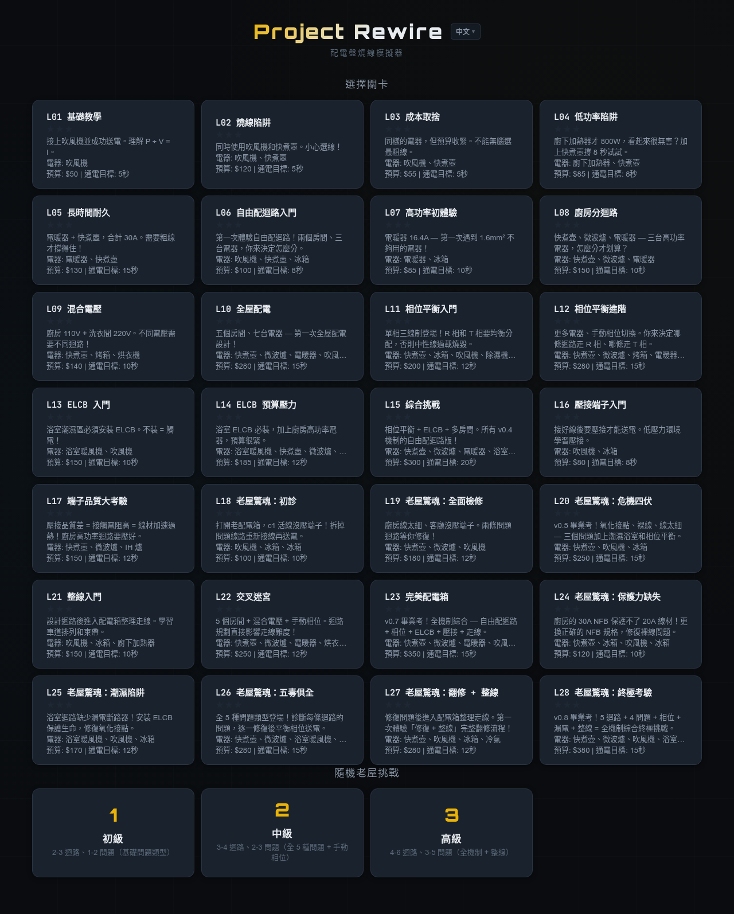
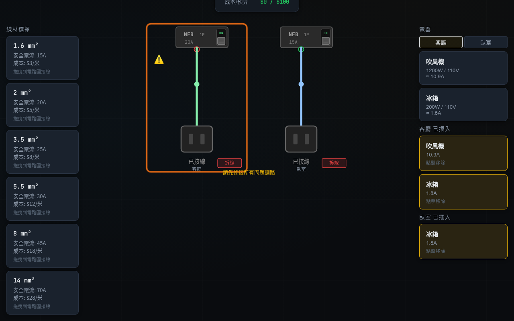

# Rewire — 配電盤燒線模擬器

體驗選線徑、接線、送電、過載跳電與燒線的 Web 互動遊戲。從單迴路基礎到多迴路配電、相位平衡、漏電保護，一路挑戰到老屋翻修與走線整理。

**[>>> 立即遊玩 <<<](https://kewang.github.io/rewire/)**

| 關卡選擇 | 遊戲畫面（老屋模式） |
|:---:|:---:|
|  |  |

## 遊戲特色

- **多迴路配電** — 自由規劃迴路，選擇線徑與 NFB 規格，管理整個配電箱
- **單相三線制相位平衡** — 分配 R/T 相位，避免中性線過載燒毀
- **ELCB 漏電保護** — 潮濕區域必須安裝漏電斷路器，否則觸電即失敗
- **壓接端子小遊戲** — 選擇正確端子、掌握壓接時機，影響接觸電阻與安全
- **老屋驚魂模式** — 面對裸線、線徑不符、氧化接點、NFB 超額、缺 ELCB 等問題，診斷並修復
- **隨機老屋挑戰** — 三級難度隨機生成，無限重玩
- **走線整理** — 在配電箱內拖曳走線、放置束帶，追求整潔美觀的配線
- **六語介面** — 繁體中文、English、日本語、한국어、Français、ภาษาไทย

## Tech Stack

- [React](https://react.dev/) 19 + [TypeScript](https://www.typescriptlang.org/) (strict)
- [Vite](https://vite.dev/) 7
- [react-i18next](https://react.i18next.com/) — 多語系框架
- SVG 視覺化 — 電路圖、配電箱內部、走線路徑
- Web Audio API — 音效合成（無外部音檔）

## 本地開發

```bash
git clone https://github.com/kewang/rewire.git
cd rewire
npm install
npm run dev
```

其他指令：

| 指令 | 說明 |
|------|------|
| `npm run dev` | 啟動開發伺服器 |
| `npm run build` | 建置生產版本 |
| `npm run lint` | ESLint 檢查 |

## 專案結構

```
src/
├── components/   # React 元件（GameBoard、CircuitDiagram、StatusDisplay 等）
├── engine/       # 模擬引擎（simulation、scoring、audio、aesthetics）
├── data/         # 遊戲資料（關卡定義、常數、房型）
├── types/        # TypeScript 型別定義
├── locales/      # 翻譯檔（zh-TW、en、ja、ko、fr、th）
docs/             # PRD 與設計文件
openspec/         # OpenSpec 工作流程（changes、specs）
```

## 部署

Push 到 `master` 分支會自動透過 GitHub Actions 建置並部署到 [GitHub Pages](https://kewang.github.io/rewire/)。

## License

[MIT](LICENSE)
